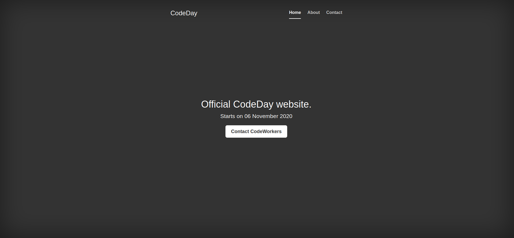

Scenario
===
We have two versions of a website.

The first version V1 looks like : 

And the second version V2 looks like : 

The goal is to insure that the version V2 of the webiste is deployed with zero-downtime after all checks pass.

I will start by playing with docker-compose techologie.

Docker compose - build docker images
===
    $> cd blue_green/app
    $> docker-compose build

    # Create tags
    $> cd scripts
    $> ./docker.sh

Create a new NameSpace 
===
    kubectl create ns codeday

Change the current default namespace 
=== 

    # To codeday
    kubectl config set-context --current --namespace=codeday

    # To default
    kubectl config set-context --current --namespace=default

Codeday v1 / v2 Services 
=== 

    $> cd Demo_CodeWorks/blue_green/k8s

    # Codeday V1 Blue Service
    $> kubectl create -f nginx-codeday-blue.service.yml -n codeday --save-config --record

    # Codeday V1 Green Service
    $> kubectl create -f nginx-codeday-green.service.yml -n codeday --save-config --record

Define environment variables for codeday-v2-blue 
===

    export DCK_IMAGE_SUFFIX=codeday-v1-blue

NGINX CodeDay v1 Deployment 
===
    cat nginx-codeday.deployment.yml | sh config.sh | kubectl create -n codeday --save-config --record -f -

NGINX Codeday v1 / v2 Public Service 
=== 
    cat nginx-codeday-public.service.yml | sh config.sh | kubectl create -n codeday --save-config --record -f -

Check Codeday Website Version 
=== 
    $> cd scripts
    $> ./curl_codeday_public_service.sh

# ###################################
# SWITCH TO GREEN AFTER CHECKS PASS !
# ###################################

Update DCK_IMAGE_SUFFIX env variable to codeday-v2-green 
===
    export DCK_IMAGE_SUFFIX=codeday-v2-green

Update NGINX Codeday Deployment 
===
    cat nginx-codeday.deployment.yml | sh config.sh | kubectl apply -n codeday --record -f -

Update NGINX Codeday v1/v2 Public Service 
===
    cat nginx-codeday-public.service.yml | sh config.sh | kubectl apply -n codeday --record -f -

# ######
# FINISH